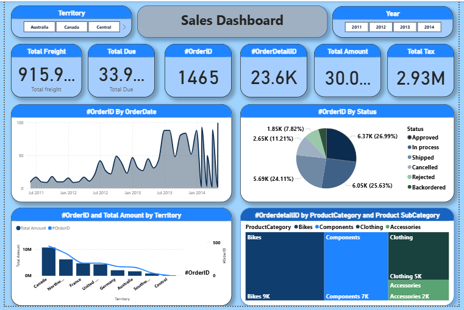

# Sales-Data-Analysis-Dashboard
# 🚲 Sales Performance Dashboard

## 📌 Project Overview
This project presents a comprehensive **Sales Analysis Dashboard** built to track and analyze business performance across different territories and product categories. The dashboard provides actionable insights into sales trends, order statuses, and salesperson performance from 2011 to 2014.

## 📊 Key Features & Insights
* **Executive Summary:** High-level KPIs showing Total Freight, Total Due, Total Tax, and Total Amount ($30.0M).
* **Sales Trends:** A time-series analysis of Order IDs over the years, showing a significant peak in late 2013.
* **Product Performance:** Categorization of sales by **Bikes, Components, Clothing, and Accessories**, with Bikes being the primary revenue driver.
* **Regional Analysis:** Breakdown of sales by Territory (Canada being a top performer).
* **Operational Tracking:** Monitoring order status (Approved, Shipped, Cancelled, etc.) to ensure supply chain efficiency.
* **Salesperson Leaderboard:** Analysis of sales distribution among team members to identify top performers.

## 🛠️ Tools Used
* **Power BI / Excel:** For data visualization and dashboard creation.
* **DAX (Data Analysis Expressions):** Used for creating custom measures and KPIs.
* **Power Query:** For data cleaning and transformation (ETL).

## 📷 Screenshots
dashboard.png
dashboard 1.png

## 📂 How to Use
1. Download the `.pbix` file from this repository.
2. Open it using **Power BI Desktop**.
3. Use the slicers (Territory, Year) to filter the data and explore different insights.
